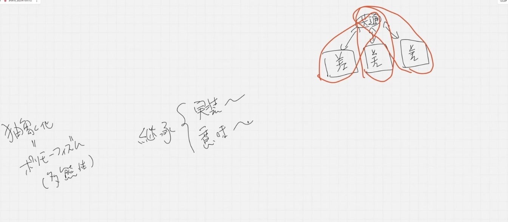
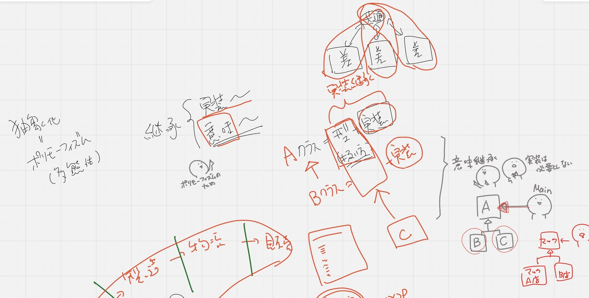
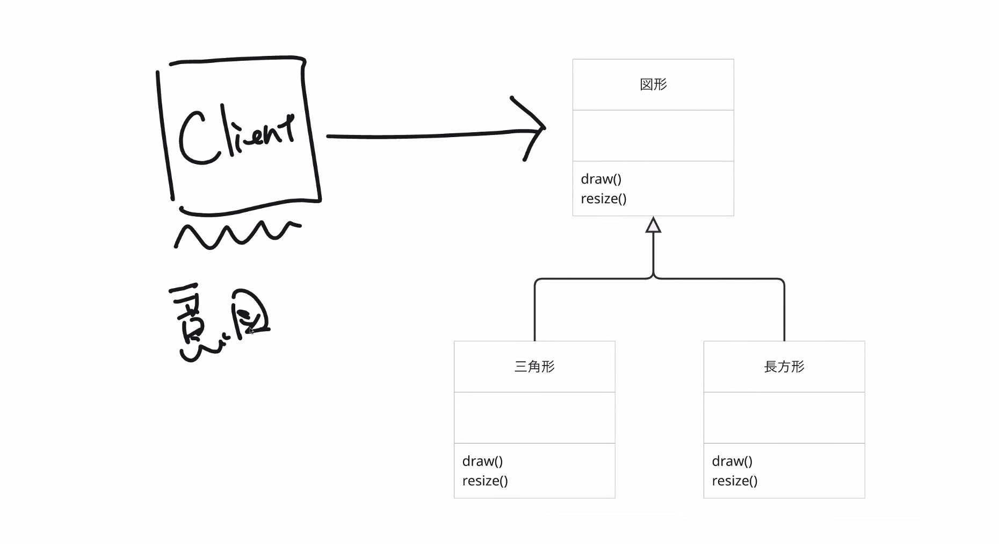
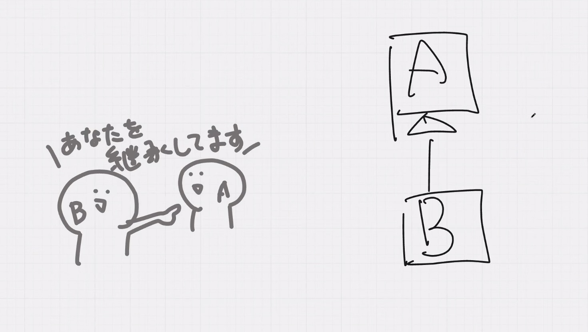
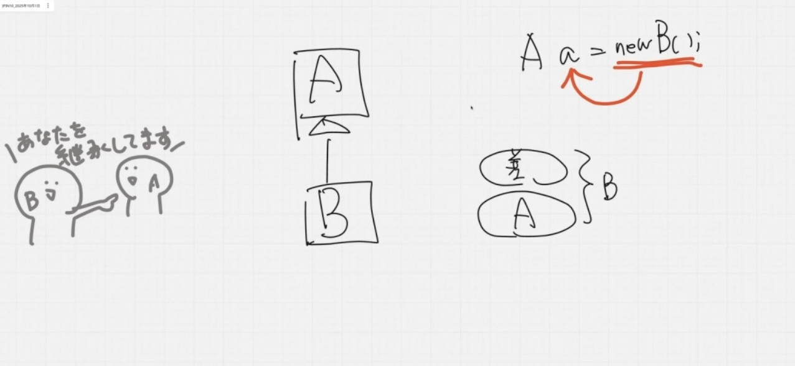
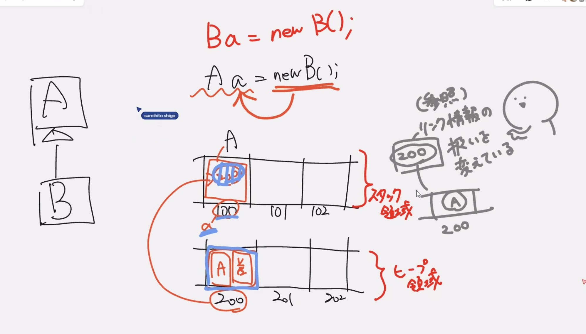
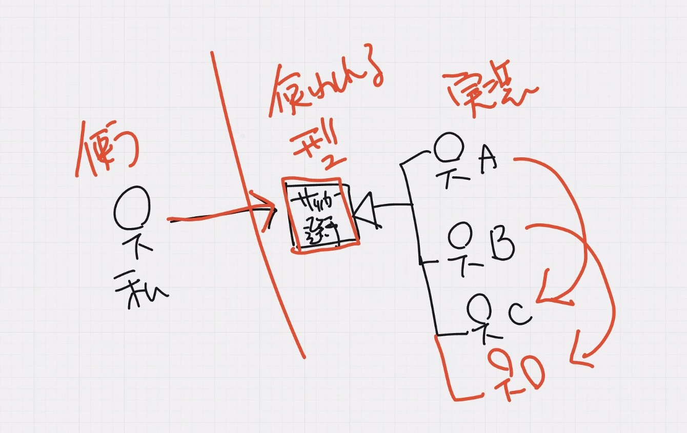

## 抽象化

共通部分だけを見て異なる部分を見ない

全体をシンプルに表現する

### ポリモーフィズム
オブジェクト指向ではポリモーフィズム(多態性)という

同じものだと思っていたけど、実際は異なる部分がたくさんある

ポリモーフィズムを実現するための継承

- 実装継承: 型情報+実装
  
  コードを引き継ぐ(スーパークラスを引き継ぐ差分プログラミング)
- 意味継承: 型(ふるまい)のみ
  
  型(扱い方)だけを引き継いで、実装がどっちでもいい

  型情報は同じものを使うが、**オーバーライド**して使用する

  

  

  意味継承: 型情報(ふるまい)しか必要としないため、実装は引き継いでいるが不要

  

⭐️意図がないとダメ

意図=clientであり、図形としてまとめて扱いたい

図形というまとまりで、角が3つなのか4つなのかの違い

意図がないとなんちゃってオブジェクト指向になって継承が多用されてしまう・・・

意図を持つものがまとまっている

UMLでは白抜きの矢印

**能動的**な向きで矢印を書く

BがAを継承している

Bのインスタンスを生成してBのインスタンスをaに代入する

Bの上に差分が乗っかっていてそれらをBとする

->差分は実際にはあるけど、差分は見ないことにする

`Aa = new B();`

AのインスタンスとAの差分インスタンスを変数aに代入する

リンク情報はあたかもaであるかのように扱ってくださいと言ってる

参照の扱いをaであるかのように扱うけど

作ったのはBのインスタンスであるが、Aのインスタンスのように扱え

⭐️扱い方が変わるだけで参照先が変わるわけではない

スタック領域(上の梯子)には参照値だけが入る

リンクをAであるかのように扱ってくださいと言ってるだけ

実際に入っているのは200への参照情報

⭐️インスタンスの扱い方ではなく、参照先の扱い方を変えている

⭐️扱いを変えたところで本体(参照先)は変わらない

参照を何で扱っているかがポリモーフィズムである

使う側と使われる側を分離する

使われる側が変更しても、使う側に影響を受けないために**ポリモーフィズム**を使う

✨コードで表してみよう

A,B,Cクラスがサッカー選手

Facatoryクラスを作成することで、呼び出し側に影響を与えない

サッカー選手であれば、誰が交代しても私には影響がない

最後にクラス図を書く

CalculatorクラスはOparatorクラスしか知らない

### ⚠️継承は意図がないとダメ！！

何をまとめて使いたいか

Calclatorは演算子を使わなくても良かった

⭐️宿題

ストラテジパターンを考えて実装する
