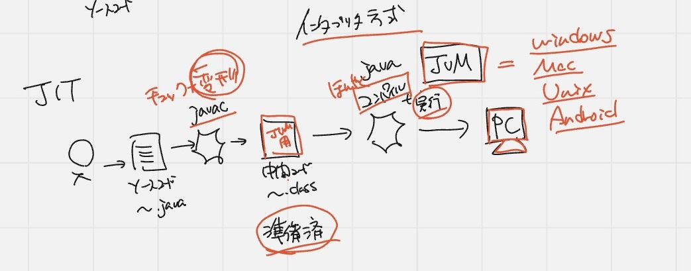
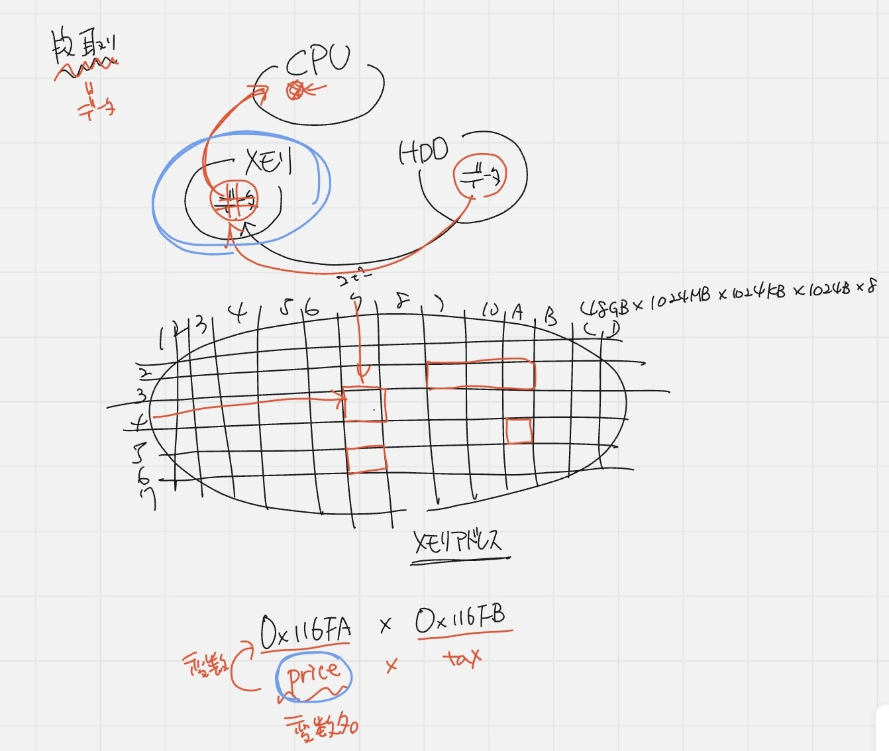
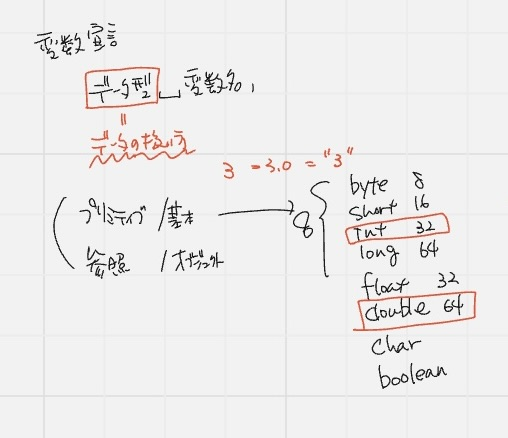
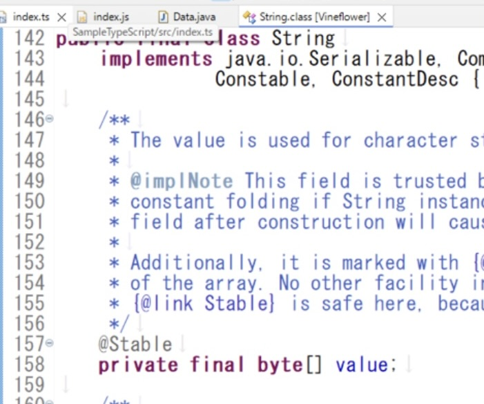

## Javaとは
- オブジェクト指向
- Write Once Run Any Where：一度書いたらどこでも動く

人間->ソースコード
⇩翻訳（コンパイル）Javacとはコンパイラのこと！！
PC：バイトコード

**インタプリタ方式**：人間がソースコードを書いて
->PCに実行してと渡す=ここでコンパイル+実行できればいいな(代表: JavaScript)
欠点は遅いこと

**Java**: 2回実行コンパイルする
人間->ソースコード(.java)->Javac->中間コード(.class)JVM専用コードになる->実行(コンパイル+実行)JavaコマンドJVMが担当

JVMはコンパイル+実行だけど、予め準備ファイルに変形しているから早い
イメージとしては、英語に翻訳する時に順番を変更してから翻訳する


- プログラムとは: データ処理の段取りを書いた手順書である
- コンピュータの3台要素とは
  - CPU: 料理人の手
  - HDD: 冷蔵庫(データを保存しておく場所)
  - メモリ: 必要なものを吸い出して処理する場所
  
  1. 冷蔵庫から材料(データ)を取り出して
  2. まな板の上にデータをコピーする
  3. まな板の上でデータを切り刻んで処理できるように小さくする

どの場所にデータを置いたのかわかるように、升目状にぶった斬ってメモリアドレス(番号をつける)を作成し、見つけやすくする

メモリアドレス(0x116FAみたいな)では分からないので変数をつける
- 変数名: priceとか
- 変数: 参照する仕組み




## データの扱い
変数宣言をして変数を使えるようにする
```
データ型 変数名;
```

重要なのは、データ型(データの扱い方)

- プリミティブ型(基本データ型)
- 参照型(オブジェクト型)

    プリミティブ型
   - [整数値]
     - byte
     - short
     - int 
     - long
   - [浮動小数店]
     - floot
     - double
   - [1文字]
     - char
   - [真偽値]
     - boolean
  
同じ値でもデータ型によって、確保されるメモリサイズが変わる(例: 3とか"3")



Stirngはbyte配列である



そのままの文字列や数値、数字を出力するデータをリテラルという

```
int a = 10;

System.out.println(a);
```

メモリはどんどん上書きするので、前のデータが残っている
変数宣言をしないと、中身を入れていない(初期化していない)状態
->**コンパイルエラー**になる⭐️

初期化しないと変数の参照ができない

## インクリメントの前置と後置

- 前置: そのままコピーして、そのまま増やす(最初の値が増える)
- 後置: 最初に別の場所にコピーを取っておいて、変数を増やしてコピーを戻す(最初の値と変化なし)


これどうなるか考える👀
```
int a = 10;
int b = a++ + ++a;
```

```
a++: 後置なのでコピーを取っておいて、そのまま戻すから10
++a: 前置なのでa(11に増えてる)コピーを取って1増やすから12

1. a = 10;

2. a++   ← まずこの式が「評価」される
   → この時点では、bの計算用に「10」を使う（コピーする）
   → でも！そのあと a = 11 に**更新**される

3. ++a   ← 次にこの式が評価される
   → 今の a = 11 を先に +1（＝12）してから使う

4. b = 10 + 12;
5. 結果：a = 12, b = 22
```


| 操作         | 表示される値       | a の中身         |
|:------------:|:------------------:|:----------------:|
| 初期状態     | ―（まだ使ってない）| 10               |
| `a++` 実行後 | 10（使われた値）   | 11（+1された）   |
| `++a` 実行後 | 12（使われた値）   | 12（+1された）   |
