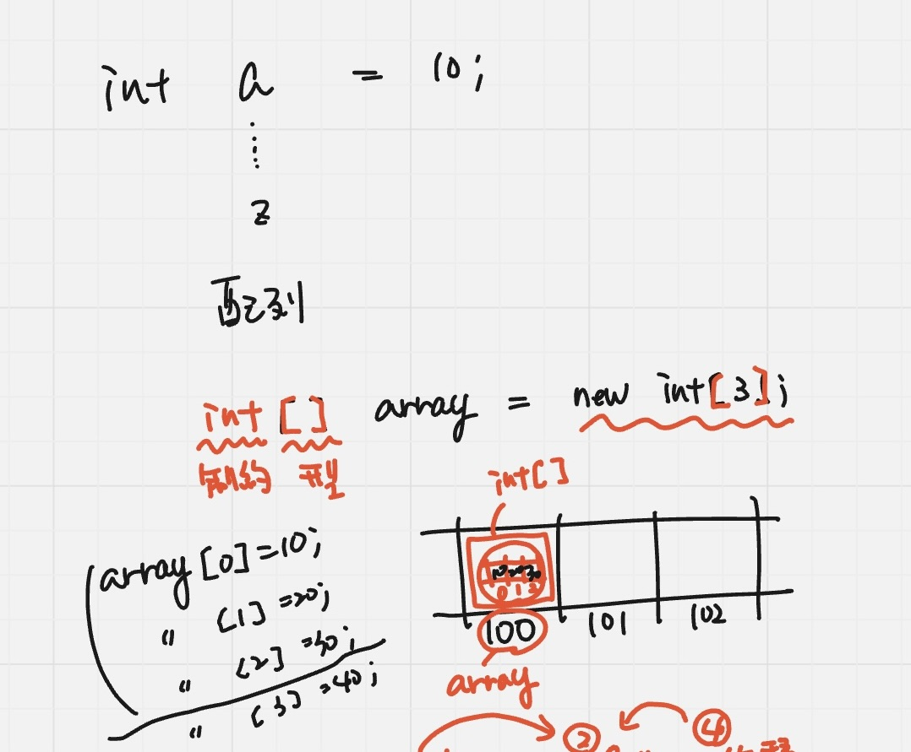

## 配列

`int a = 10;`

たくさんのデータを扱う場合

1つの配列で複数のデータを扱う

同じ種類のデータしか扱えない


`int[]`

**int: 制約** ※重要✨

**[]: 型** ※重要✨

int型しか扱わない変数のarray
であるため、配列しか入らない

```
nt [] array = new int[3];
```

メモリ上ではどうなる？

`[3]`: 3つの区画を持つ(番号のことを添え字という)

arrayと添え字を指定する＝arrayの0番目、arrayの1番目

100番地に10,20,30と入っていく



### for文のネスト

外側の繰り返し
縦＝行（横の並びを何行出すか）


従来のfor文は1個飛ばしで出力したい場合くらいしか使わない
        for (int i = 0; i < array.length; i++) {
//            System.out.println(array[i]);


内側で何をやっているか考えてから、外側を考える

else: 振り分け処理ができる

条件を追加したければelse if


### switch文(振り分けが少ない時)
aの値が何かによって、条件の振り分けができる
`case`を使う
breakを書かないと、一致したところ以下全てが表示される(フォールスルー)

switch文: 処理の振り分け
switch式: 値の結果を戻す(必ずどこにも引っかからないdefaltをつける)
Stiring switch(a) {
    // Aを返す
    case 1 -> "A";
    case 2 -> 
}

switch式は計算式

### enum(switchと相性が良い)
列挙型
enumに宣言したものしか指定できない

switch式で(r)を渡す
引数: 数値か文字列かenumかと決まってる

変数宣言の時にも変わらない値を大文字で書くのは慣習(エラーにはならない)

enumは定義するものだと考えよう
length: 組み込み関数であってメソッドではない
だから()がない

コンパイルするとクラスに変わる
フィールドもメソッドもコンストラクタも書ける
