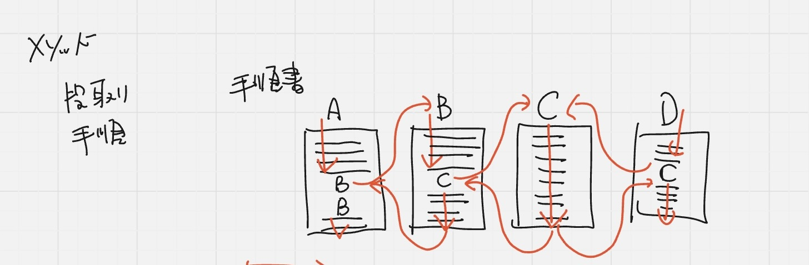
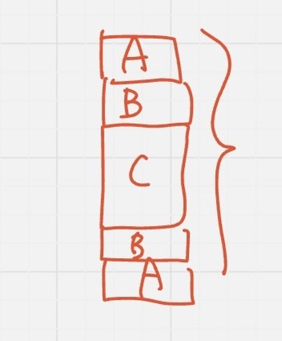
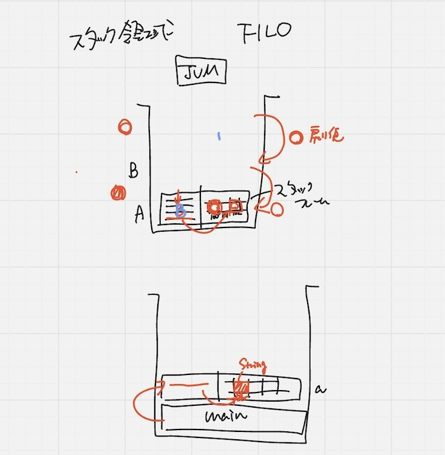

## メソッドとは
- 段取り
- 手順
プログラミングじゃなくても○○メソッドとかいうやつ

手順書
1. Aから実行している途中でBをやれと書いてある
2. Bの手順書を探して、一番上から順番にやる
3. 途中でCをやれと書いてある
4. Cを一番最初からやる
5. Cが全部終わる
6. Bの途中（続き）から実行し完了
7. Aの途中（続き）から実行し完了
8. 全て終了🙌

Aの前半->Bの前半->C全部->Bの後半->Aの後半

図にかけば理解できる✨




### 何故ひとつの手順書にしないのか？

凄く長くなってしまうので手順書を分けたい

1. 全体の処理を１ずつ分かりやすくするため
2. 再利用しやすくするため

問題は順番を間違えてしまわないか

FILO（フィロ）の構造 = バケツを持っている
メモリ領域（スタック領域で順番を管理する

スタック領域（メモリ領域）とは
下から積み上げる
取り出す時は上から
->逆になる = 先入後出し

図に書いたら分かるよ

1. Aのスタックフレームの上にBのスタックフレームを積み上げる（Cをやれと書いてる）
2. その上にCのスタックフレームを積み上げる
3. C全部取り外し
4. B残り取り外し
5. A残り取り外し

全部終わったら処理完了



## スタック領域

スタック領域に積み上げられるのは**メソッドの定義のコピー** = スタックフレームという

四角の積み上げられるのはスタック領域

スタック領域 = 手順書(順番) + スタックフレーム(梯子の絵 = 保存領域)

常に上からしか見てないので、Aの途中であればBを積み上げる

⭐️領域を飛び越えてアクセスできない->どのタイミングでどんな処理をするかわからなくなるから

->領域を飛び越えて(スタックフレームを跨いで)の処理はできない

では、違うスタックフレームのデータを使いたい場合は？

->Aの上のBに**コピー**を渡せば良い(引数)

###  ⭐️引数とは = 処理の実行するために必要なデータのこと

**引数**は必要なデータであり、このデータがないと処理を進められない->コンパイルエラーになっちゃう

AにBを積み上げた時にはAのデータのコピーを渡せば良い(引数)

元あるデータをコピーして渡されたデータのこと

引数を宣言して使う

受け取る側はどこにデータを入れておく？

入れてもらったら初めて1行目の処理が始まる

スタックフレームを取り外す前に、コピーしたデータを戻すことができる(戻り値)

データを渡されたらどこに入れる？->自分のローカル変数しか使えないので

1. そのコピーを入れる
2. Bの処理が始まる

途中にCをやれと書いてあるので、データをコピーしてCに渡す->Cはローカル変数にアクセスして処理を開始

->Cの処理が終わったらCを消さないと次の処理ができない

->Cを取り外す前にデータを渡さないとBの処理ができない

->CはデータのコピーをBに渡す

⭐️コピーして渡す、コピーして渡すの繰り返し

voidは引数を渡さない

voidの後のが**メソッド**

プログラミングとは：考えること

## mainメソッド

```java
// mainがありませんエラー
public class Main {
	public void a() {
		System.out.println(“a”);
```

⇩ 修正
```java
// 複数のメソッドがあってどこから始めていいのか分からなくなる
public class Main {
	public void a() {
		System.out.println(“a”);
}
	public void b() {
		System.out.println(“b”);
}
	public void c() {
	System.out.println(“c”);
}
public static void main(String[] args)
}

```

⭐️エントリーポイント

⭐️メソッド呼び出しをする

staticを足すとエントリーポイントで
