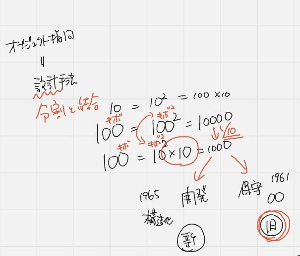
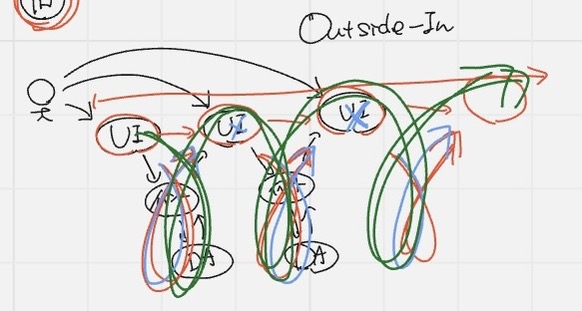
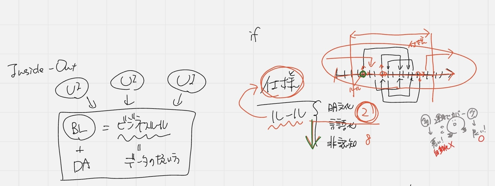
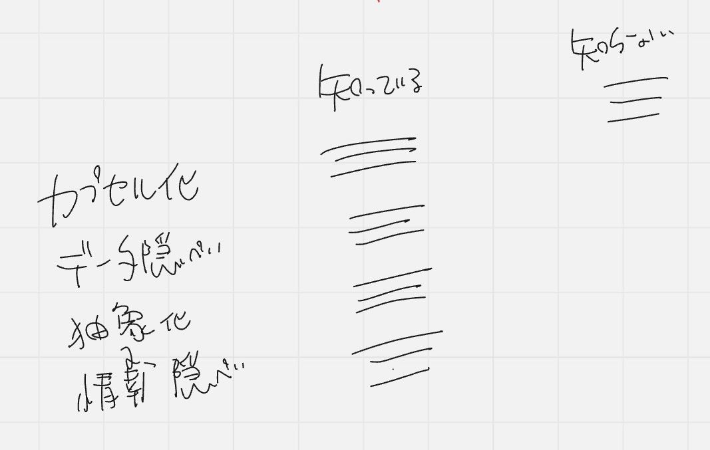

## オブジェクト指向

オブジェクト指向とは: 設計手法の1つ

設計とは: 分割と結合(どう分けてどう繋げるかを考える)

コスト削減のために設計をする

規模が100のアプリの設計を考える

100 = 100の2乗 = 10000

100 = 10(10 x 10)の2乗 X 10 = 1000(10分の1のコストで済む)

->分ければコストが軽減できる

->分けて考える方が理解しやすい

- イニシャルコスト: 開発コスト
- ランニングコスト: 保守のコスト(アップデート)やり続けるもの

->これらは相反関係(シーソー)にある

◆オブジェクト指向設計: 保守のコストを下げるがイニシャルコストは5〜10倍に跳ね上がる

◆構造化設計: イニシャルコストを下げる(新規開発向き)

いかに簡単に素人に近い人が開発できるか(昔は重宝された)

どちらのコストを削減させたいかで設計を考えるので、エンジニアはどちらもできなければならない

UI(ユーザインターフェース): ユーザがどんな行動(利用)をしてくるのか

## Outside-in ✨画面が先で圧倒的に多い

◆長所
- Outside-inとは: 表(外部)から作るので分かりやすく、説明もしやすい
- 流れがあるので分かりやすい
- 途中から参画した人も分かりやすい

◆短所
- 前後関係が変わると変更範囲が大きくなる
- 画面表示が変わると、前の段階でデータを取ってくるなどの影響
- 全てが繋がっているため、流れが乱れると大変

## Inside-out ✨裏側から作る(オブジェクト指向)

ビジネスロジック(ビジネスルールのこと) = データの扱い方

⭐️仕様とルールは別物
- 仕様: 仕事の流れのこと(どんなパターンの流れで作らなければならないか)
- ルール: 流れを分岐させる条件のこと、データの種類・値で決まる

1. ビジネスルールとデータをがっちゃんこ
2. UIもがっちゃんこ

    ->画面が最後

◆良いシステム: 運用でカバーする範囲が少ない = 自動化が広い

    上流の成果物と下流の成果物であまり変わりがない

    言っていること(ルール)とコードがあまり変わってない

◆悪いシステム: 運用でカバーする範囲が広い

### オブジェクト指向は
- 再利用性が高いか？: そうでもない
- 再利用性が高いか？: 設計による

4つの知っていることと知らないことを明らかにする

- カプセル化: 関係するデータと処理をまとめること
- データ隠蔽: データを隠す
- 抽象化: サッカーも野球も`スポーツ`である
- 情報隠蔽: publicクラスの中にprivateがある。隠すデータと隠さないデータがある

