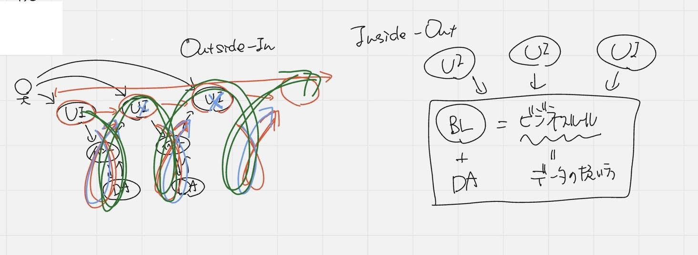

## カプセル化

カプセル化とは: 関係するデータとその処理をまとめること

データは単独で存在していても分からない(例: 名前のみ)

前後関係を全部読まなければならないので大変

関係するでデータを纏める: 名前、製造年月日、消費期限

✨過不足なくデータを作る(無関係のデータを入れてはダメ)

変更の際、どこに影響があるのかすぐにわかることが必須‼️

⭐️変更の際どこに影響があるかすぐにわかることが必須

### 仕様変更に強い設計とは

1. 影響範囲が特定しやすい
2. 変更作業が楽

グループを作ることが必要
1. が前提(変更の影響範囲がどことどこなのかをすぐに特定)できる

### Outside-in

変更に弱い

カプセル化しない(カプセル化を壊してしまう可能性があるため)

フィールドなし、getter,setterによってデータがどんどん運ばれていくことになる

->オブジェクト指向テクノロジーのメリットを一切使えなくなる

->処理の流れを作るプログラムを作る

### カプセル化とは💊

1. 関係するデータを一つに纏める(纏めると意味が分かる)
2. データが必要とする処理を纏める

目的：仕様変更が入った時にその影響範囲を特定しやすいようにする

従来のモジュール：関数やメソッド

⇩

カプセル化されたモジュール[1]と[2]: オフジェクトと呼ぶ

✨オブジェクト ≠ モノ

✨オブジェクト = 分割された意味のあるモノである

### getterとsetter

ビジネスロジックを作る時に使ってはダメ❌

理由：いろんなところで影響が出る

⭐️よくある説明：フィールドをprivateにして、アクセサメソッド(getterとsetter)を用意するものだというのは良くない❌

⭐️カプセル化の原則に従うとgetterとsetterは不なのでは？

内部にデータはあるけど、中身は伏せる

->外部から見れないので壊されることがない

カプセル化 + データの隠蔽 = セットで扱う

カプセル化：影響範囲が特定できる

データ隠蔽の目的：カプセル化の維持、カプセル化を壊さないため

オブジェクトは出来上がると繋げることが必要になる