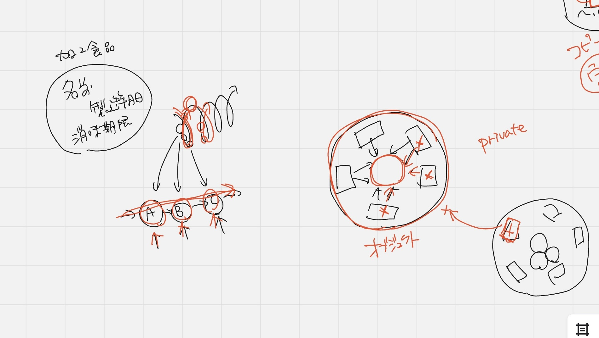
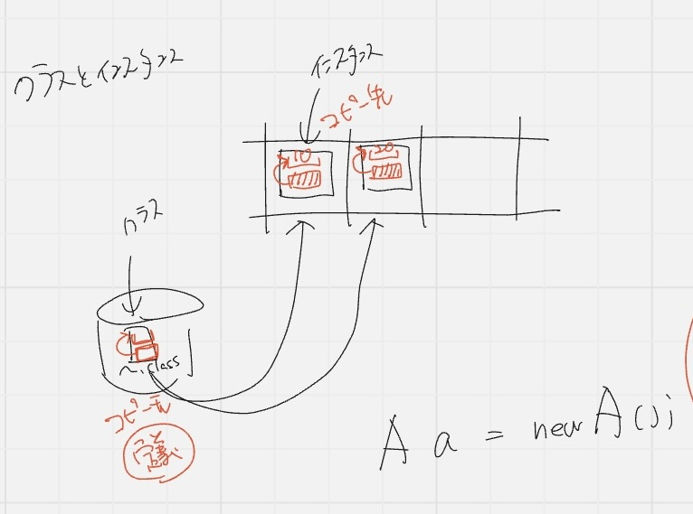
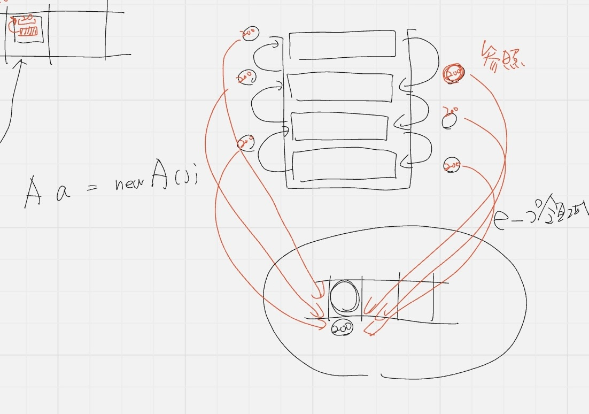
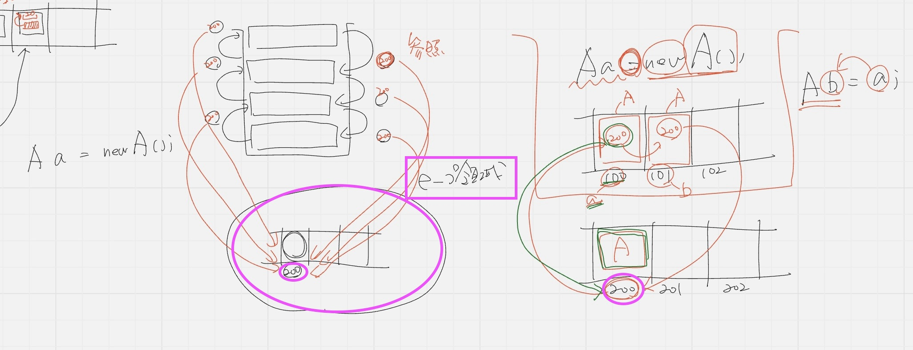
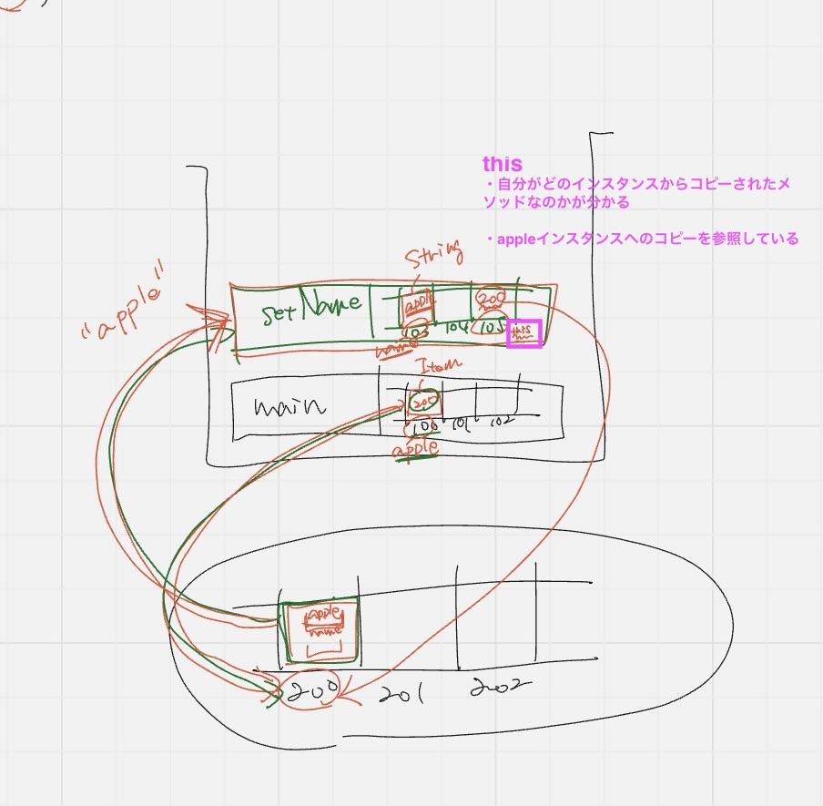

## カプセル化

カプセル化とは: 関係するデータとその処理をまとめること

データは単独で存在していても分からない(例: 名前のみ)

前後関係を全部読まなければならないので大変

関係するでデータを纏める: 名前、製造年月日、消費期限

✨過不足なくデータを作る(無関係のデータを入れてはダメ)

変更の際、どこに影響があるのかすぐにわかることが必須‼️

⭐️変更の際どこに影響があるかすぐにわかることが必須

### 仕様変更に強い設計とは

1. 影響範囲が特定しやすい
2. 変更作業が楽

グループを作ることが必要
1. が前提(変更の影響範囲がどことどこなのかをすぐに特定)できる

### Outside-in

変更に弱い

カプセル化しない(カプセル化を壊してしまう可能性があるため)

フィールドなし、getter,setterによってデータがどんどん運ばれていくことになる

->オブジェクト指向テクノロジーのメリットを一切使えなくなる

->処理の流れを作るプログラムを作る

### カプセル化とは💊

1. 関係するデータを一つに纏める(纏めると意味が分かる)
2. データが必要とする処理を纏める

目的：仕様変更が入った時にその影響範囲を特定しやすいようにする

従来のモジュール：関数やメソッド

⇩

カプセル化されたモジュール[1]と[2]: オフジェクトと呼ぶ

✨オブジェクト ≠ モノ

✨オブジェクト = 分割された意味のあるモノである

### getterとsetter

ビジネスロジックを作る時に使ってはダメ❌

理由：いろんなところで影響が出る

⭐️よくある説明：フィールドをprivateにして、アクセサメソッド(getterとsetter)を用意するものだというのは良くない❌

⭐️カプセル化の原則に従うとgetterとsetterは不なのでは？

内部にデータはあるけど、中身は伏せる

->外部から見れないので壊されることがない

カプセル化 + データの隠蔽 = セットで扱う

カプセル化：影響範囲が特定できる

データ隠蔽の目的：カプセル化の維持、カプセル化を壊さないため

オブジェクトは出来上がると繋げることが必要になる

抽象化することで、ぐちゃぐちゃ回避

## 抽象化

共通部分だけ見て異なる部分は見ないようにすること

スポーツ選手：サッカー選手、野球選手、バレーボール選手の共通部分

共通部分（スポーツ選手、ボール、ルールなど）

共通部分同士で結合することでシンプルな結合状態になる

✨抽象化してから繋ぐとシンプルになる

抽象化は1つだけ作すと全体が把握しやすくなる

⭐️まずカプセル化しないと抽象化できない -> **カプセル化** が最重要

## 情報隠蔽

抽象化で見なかったプログラムの修正が必要

どんどん線が絡み合って複雑になり、どこに影響があるか分からなくなる

情報隠蔽 + 抽象化：ほぼセット

抽象化により強固なものにすると情報隠蔽になる

情報隠蔽のデータとは

- オブジェクトの内部（1個のデータを隠すこと）
- そのソフトウェアを構成するモジュールのこと（全部の中で非公開クラスを隠す）

`package` を使って公開するクラスと非公開クラスを分ける

`public` ：唯一の公開クラス（外部からアクセスできる）

公開クラスの中で、**公開する部分** と **非公開の部分** を分ける

理由：たくさんの部品から公開しているデータやメソッドしか使わないから、間違いが少ない

1. カプセル化
2. データ隠蔽
3. 抽象化
4. 情報隠蔽

⭐️オブジェクト指向を書く時にクラス名から書くと失敗する

どんなデータを使うかから書く(ERモデルみたいなところから)

## クラスとインスタンス

Javaは **クラス** という単位でプログラムを作っていく

クラス：HDD(冷蔵庫)に保管されている

データ：食材をまな板に乗せてから調理する

✨移動という概念はないので、メモリ上にコピーする = **インスタンス(コピー先)**

✨HDDに入っている`.class` = **クラス(コピー元)**

⭐️コピー元とコピー先の関係があるから異なるデータを扱うことができる

aのインスタンスを作る時

`A a = new A()`

スタック構造を使って、上に積み上げて **メモリのコピー** を作っている

- データをコピーして **引数** としてデータを渡し
- データをコピーして **戻り値** としてデータを戻す

### ヒープ領域：新しいメモリ領域(保存領域)

大きいデータの場合、コピーして渡すだけだと時間がかかりすぎる

->新しいメモリ領域 **ヒープ領域** を作る

1. ヒープ領域にデータのコピーを置いておく(大きいデータ)
2. 引数と戻り値は、ヒープ領域の **アドレスリンク** を渡していく

✨ヒープ領域にリンク情報があれば、あちこちからアクセスできる

✨リンク情報(200番地)のことを **参照** という

` A b = a;`

変数aでもbでも同じインスタンスに辿り着く

->扱い方を決めるのが **データ** 

## 実装

`a` と `b` が共有されていることを確認するコードを作ろう

`private` をつけると呼び出し側に `setter` を付けなきゃだめ

⭐️ `this` は自分自身の **インスタンス** を指す

`setName` メソッドをコピーして上に積む(緑) `"apple"` という引数が入る

⭐️`this` : 積み上げた時に勝手に作られる変数

- `get` メソッド：変数をそのまま使う
- `this` 自分がどのインスタンスからコピーされたメソッドかが分かる(インスタンスの参照元、元データが分かる)
- 変数 `this` は200番への参照なので200番のメモリが持つ `name(apple)` を代入すると書いてあるので `apple` が入る
- `setName` が呼ばれたら、勝手に `this` が出来上がる

- `main` から `this` は `apple` インスタンスへのコピーを参照している

- `main` には `this` がない
- `this` を取ると自分の `name` に `name` を代入するだけだから何の意味もない(ブロック内しかアクセスできないから)
