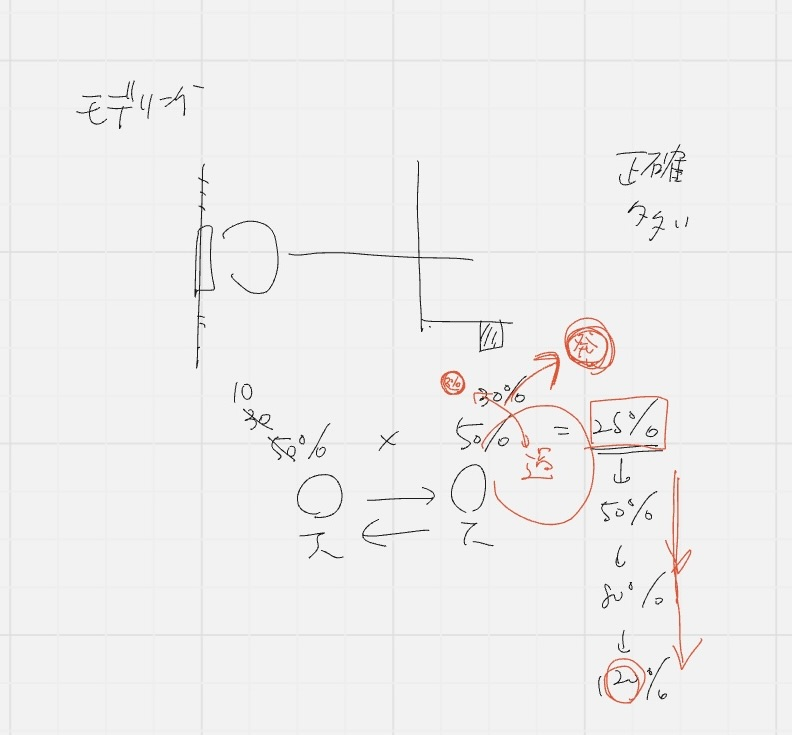
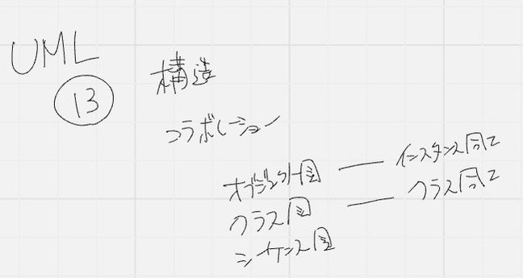
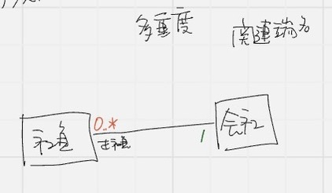
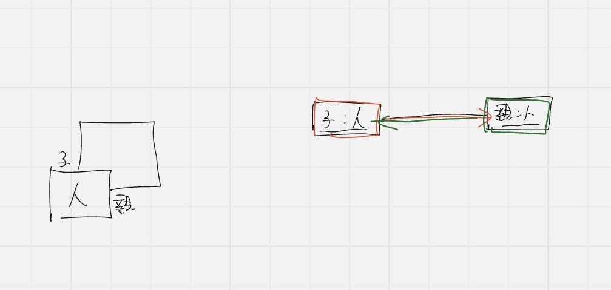
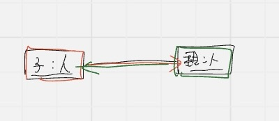
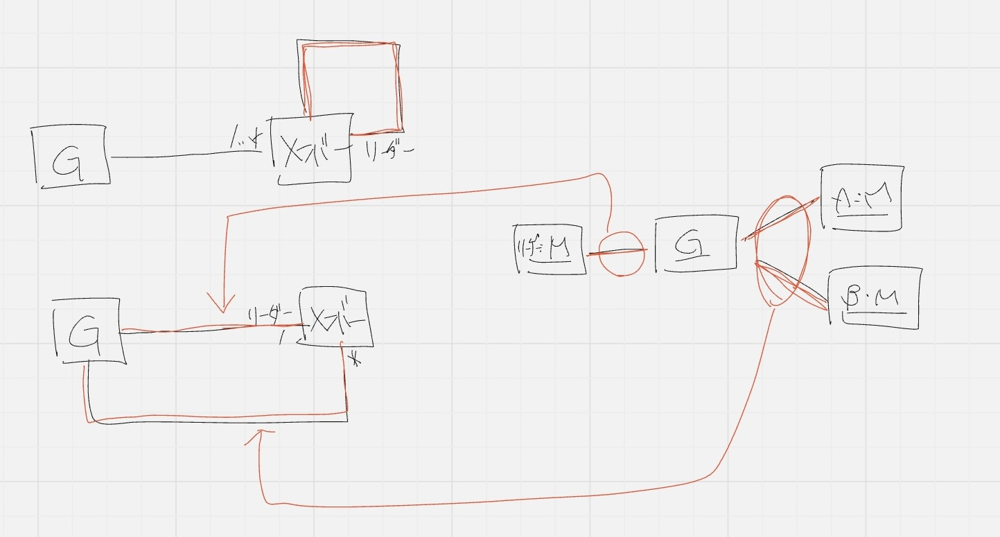
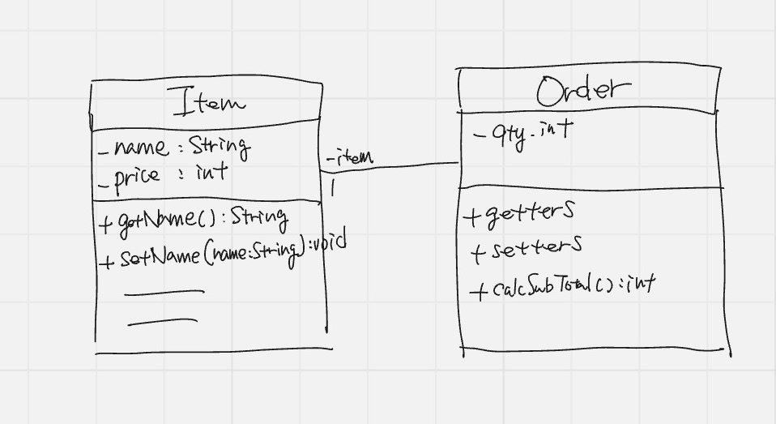

# モデリング

## モデリングとは：対象物を模したもの

相手が必要とする情報と必要としない情報を見極めて、いらないものを切り捨てる

情報量の多さはコミュニケーションを阻害する

トークが最大25%しか伝わらない(コミュニケーションの現状)

言葉によるコミュニケーションが脆弱

映像とその時の感情でできているため、言語化が大変

Max50%なので、聞いてる方は最大25%しか伝わらない

増える場合：聞いたことと自分が元々持っている知識 = 新しい知識にする

-> 強制的に起こす必要があるが、情報量も増えるのでパニくる

例: 新人に言い過ぎるとパニック

突合を減らす

発想を促すのが**モデリング**

モデルは想像力を掻き立てる



## UML(統一モデリング言語): 13種類の図から成り立ってる
- 構造を表す図
- 動きを表す図(コラボレーション)

⭐️クラス図: クラス同士の関係性を表す
⭐️シーケンス図(動き)
⭐️オブジェクト図: インスタンス同士の関係を表す

### クラス図

Aというクラス名

3つの構造があるが、最低必要なのはクラス
以下オプション

- 状態(フィールド)
- メソッド(フィールドを使った振る舞い)



⭐️社員と会社の関係

- 社員から見て会社はいくつある？
- 会社から見て社員がいくつある？

    表すものを「多重度」という

    ```
    0..*　: 0以上
    ..　：以上
    ```

関連端名(かんれんたんめい)

会社から見て正社員(全員正社員とわかる)




親子関係のクラス図を書く

一発で正解しようとせず、書いてみることが重要(揺さぶりをかける)

子も親になる(揺さぶり)

自分、父、母

おじいちゃん

ひいじいちゃん

孫、ひ孫

子から見ると親だけどGから見ると子じゃない？

->やり直す

クラスが分かれてると種族が違う

従って親子に分けるのはおかしいと気づく

親クラスと子クラスに分けちゃダメ‼️

->親子関係を分けてはならない->同じ「人」であるとする



⭐️再帰処理を使って「人」とする

こちらから見ると「親」であちらから見ると「子」である

-> **関連端名**を使う✨

->オブジェクト図

### オブジェクト図

子：人　下線を引く

- 人から作られた親インスタンス

- 人から作られた子インスタンス
  
->別々のインスタンス

再帰の図と一直線の図は同じことを表している

「人」というクラスで「子」というインスタンスが作られている

人：子　更に下線を引く

クラスが違う = 定義が違う（属性が違う）

親にも子にも身長、体重を持ってる->クラスを分けるとおかしい



1. グループ
2. リーダ：1人必須でリーダとわかるように明示すること
3. メンバ：0人以上

の関係

想定される条件をずらすとどうなるか->本来どんなモデルが良いのか検討する

メンバとリーダの再帰にする -> グループから見てリーダなのか分からない

上の図だとメンバからしかリーダが分からないから🆖



下の図にするが、リンクが

オブジェクトの線 = リンクという

クラス図の関連はオブジェクト図のリンクを束ねたモノ

モデリングとプログラミングの技術は全く別

絵を描くとかこの思考に至るには、練習することが必須（練習量）
->使いこなそう！！

モデルを書いて実装すると、モデルが全然だめだと分かるので繰り返しやっていく

圧倒的に練習不足

✨個人開発でモデリングから実装への経験をすべき

難しい❌

慣れてない⭕️

オブジェクト指向の時にクラスから考えるのはダメ

どんなデータか分からないとルールが作れない

Itemクラス

2つフィールドがあってそれぞれgetter,setterがある

❓UMLで書くとどうなる❓

クラスは3つの区画に分かれる

- クラス(Item)
- フィールド属性(-name: String)(-price: int)マイナスはプライベートカプセル化したやつ・・設計書に書くと逆になる

```java
name: String
```

- getter,setter: +getName(): String + はpublic

注文クラスを作ろう

Orderクラス(どの商品？数量？を定義するクラス)

どの商品かの関連なので線を引く



多重度: 1
