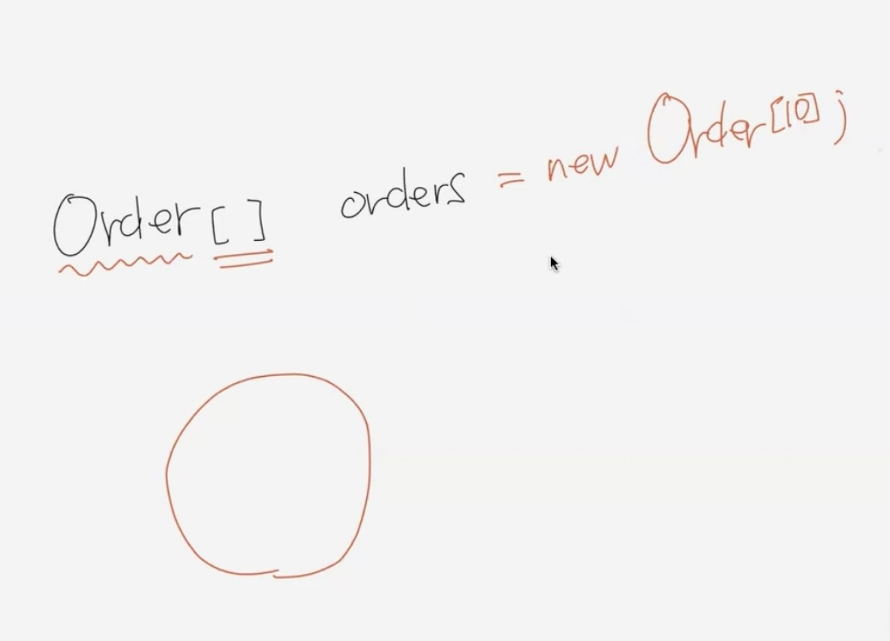
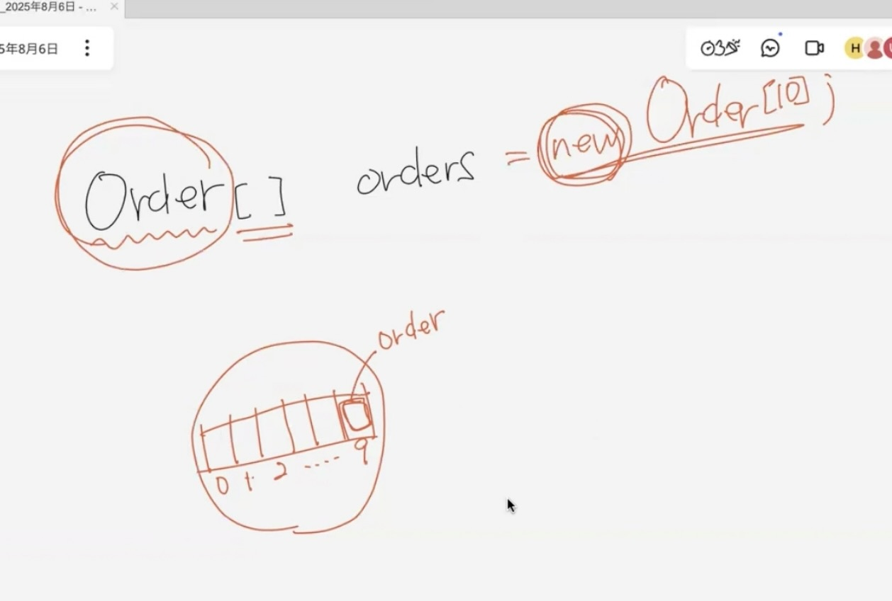
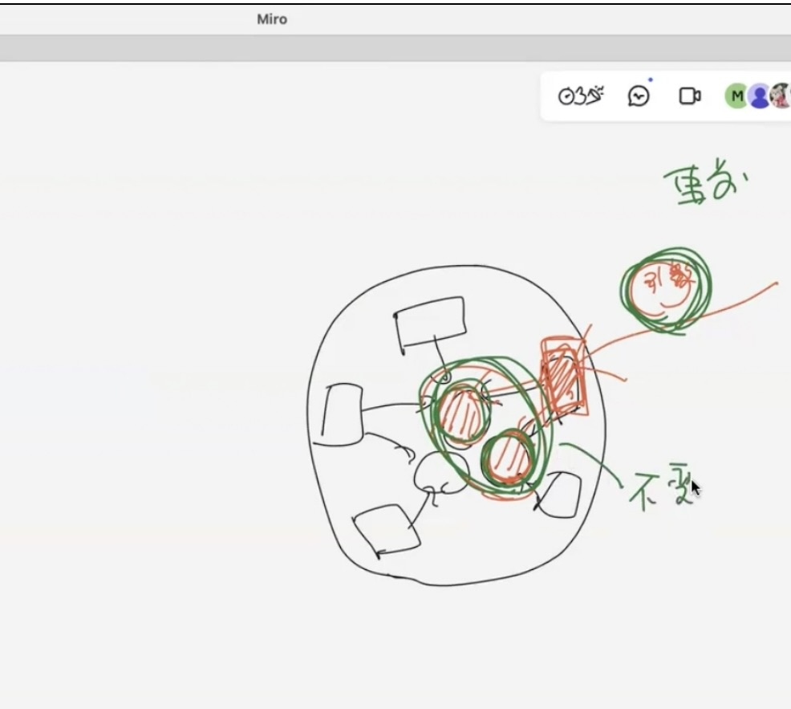

# コンストラクタ

ShoppingCartクラス：Orderを複数持ってOrderをまとめるクラス

配列を使って複数のOrderを宣言する

[]にはどんなデータ型の制約があるのかを書く

配列は配列のインスタンスを作る

インスタンスを使ってからヒープを作る

### DesignByContract
契約による設計

使う側が使われる側を利用する = 依存関係

考える条件3つ

1. 事前条件：使う側があらかじめやっておく準備

   (例) 
   - メソッドはこの順番に呼ばなきゃならない
   - 買い物にお財布を持っていく
   - お店が開いている、商品が陳列している

2. 不変条件：使われる側が呼び出される前に安宅じめ用意しておく準備

(例)
- インスタンスの条件
- フィールドが最初にどんな状態(0とか)でなければならないとか

3. 事後条件：メソッドを呼び出す条件

### カプセル化とは
- データをまとめる
- 処理をまとめる

オブジェクトの条件は **モジュールとしてまとめる**
- 関係するデータをまとめる
- データが必要とする処理をまとめる

引数はカプセル外部から与える

内部も与える(= 内部がどういう状態か決めておかないとおかしくなる)

どんなデータが外部から与えられて(=事前条件)

内部のどんなデータが依存しているのか(=不変条件)

