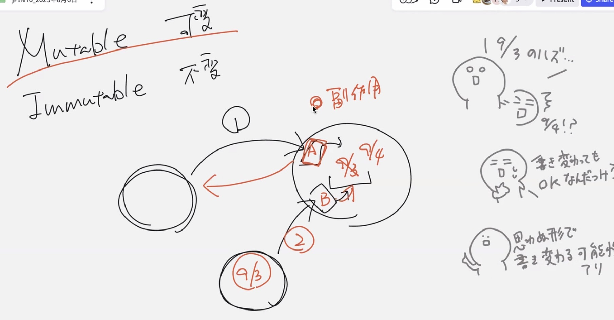
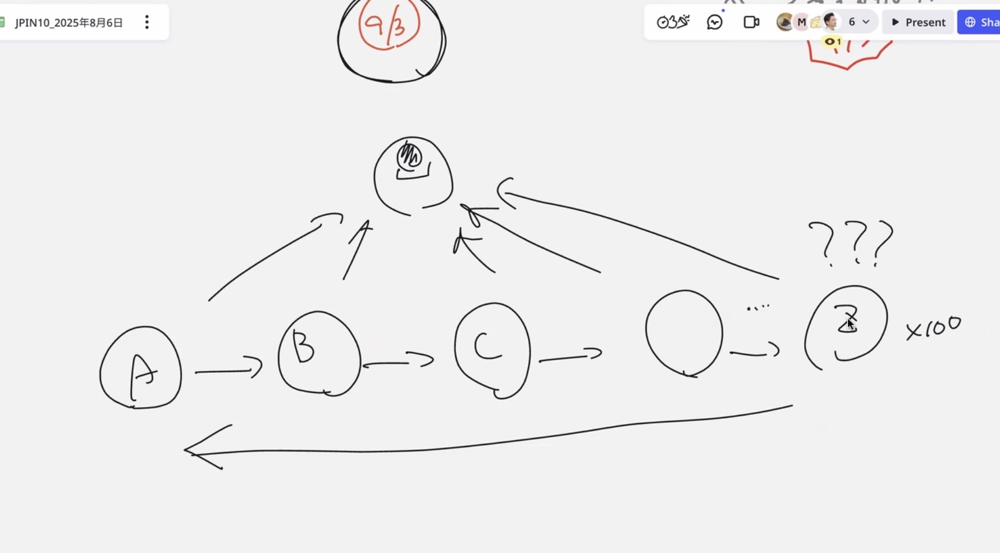

# 可変オブジェクトと不変オブジェクト

## Mutable: 可変オブジェクト
オブジェクト内部にはフィールドがある
外側のメソッドがない部分のメソッドを呼び出す
->内部データが9/4に変わってしまった
->この状態が可変オブジェクト

- 事前条件: 使う側があらかじめやっておかなければならない条件
- 不変条件: 使われる側があらかじめ準備をしておかなければならない条件
インスタンスができると同時に「Ohsawaさんね」と認識できるようにしておかないとダメ
- 事後条件

他のオブジェクトが内部データを呼び出す

- ①最初9/3
- ②9/4に変わってしまった

    9/3のはずだったのに・・・の現象を**副作用のあるメソッド**という

    結果を戻すだけではなく内部データを9/3から9/4に書き換えると、呼び出す②は9/3だと思って呼び出している

    内部が変わってしまうと周りにも確認が必要

    

✨Mutableじゃないとダメな理由

メソッドをどんどん引き継いでいくが、どのタイミングで書き変わったのか分からない場合、全部戻って確認しなきゃならなくなる

Zに来てようやく分かるとなるとデバッグがすごく大変

->副作用がいつ起こってるか分かることが必要

⭐️Imutableは内部のデータの変更せず新しいデータを作成する

Mutableじゃないとダメなのは？

どのタイミングでデータが変更されたのか考えないと

インスタンスを増やす

年を取るたびにカウントアップしたインスタンスが増える

