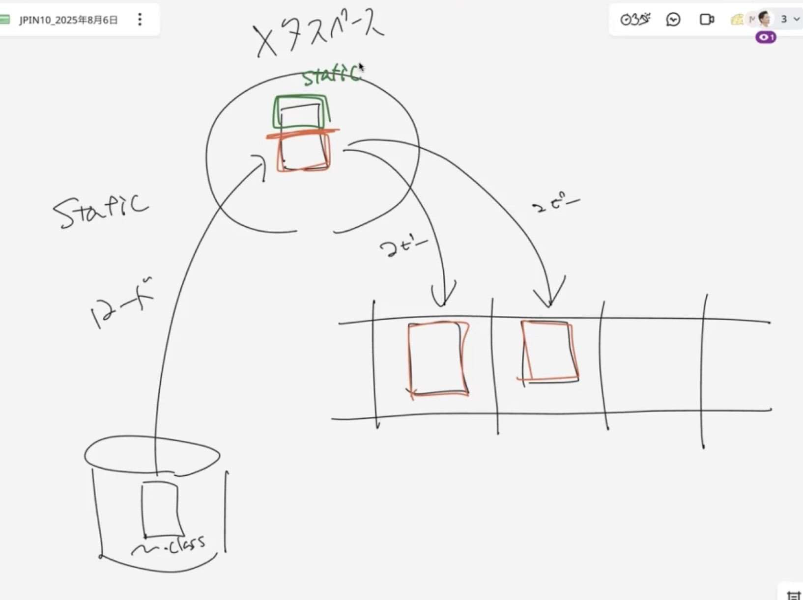

# static

値をむき出しにしない

getterを使っちゃいけない理由は？

getterは内部のフィールドの値のコピーを戻す

参照だったら..

内部のデータを直接参照、直接書き換えられてしまう可能性がある

->ビジネスロジックでgetterを使っているのはおかしい

**カプセル化**: 必要としている「処理」と「値」を纏めたもの

## getterをなくそう

処理が多くなるのを避けるため

○->○->○->○

森を見て木を見ない状態になる

他の状態を見なくても単体で動作できる状態を作りたい

⭐️外への処理が理解が必要

⭐️処理の流れは見なくて良い

getterを使うと・・全ての処理のつながりの理解が必要

切り出した単位だけで理解できる繋がりを作らないと、保守ができなくなる(部品単位)

✨完全なブラックボックス化するのを防ぐために**カプセル化を維持する**＆**getterを使わない**

内部の状態が他の内部のつながり

処理の流れは見なくても、どういう機能を持った部品なのかを明確にしたい(緑)

できるだけ切り出した状態を作り出さないと保守がしにくい

流れをコードで表現するのはやめましょう

->ブラックボックス化する

->ここだけで処理を完結させたい✨

⭐️`final`: 参照は変えられないけど参照先は変えられる

参照先のオブジェクトの値は変更できてしまう

参照先を持っていることは変更できないが、参照先情報をもっっているから中身をいじることができる

->⚠️不変条件が崩れる可能性がある⚠️

- あるオブジェクトが他のオブジェクトの参照をもっているとする(100)
- AとBのオブジェクトは繋がっている(関連しているオブジェクト)
- Aは9/10というデータを持っているBを呼び出す
- Aを呼び出したXには9/10(結果)を返す
- AがMutalbleだった場合、内部データを変更してしまう可能性あり
- 9/10のつもりでBにアクセスしたら、Bは9/11の処理を返すことになる(9/11に変更されているから)
- ⚠️仕様と違う！！という結果になるかも⚠️

    

     
    カプセル化はものすごく重要だが、ものすごくおざなりにされている

    

オブジェクト指向の特徴

## static

クラスとは: ディスク上に保存されているクラスファイル(.class)

インスタンスとは: メモリ上に作られたクラスファイルのコピー

この図だと困る場合がある

ディスク上にあるクラスファイルがインスタンス化するたびにクラスファイルができることが問題⚠️

コンピュータの中で一番遅い処理 = ディスクアクセス(読み込み)

⇩

ディスクからコピーを取らず、仮置きすればいいのでは?

= メタスペース(ヒープの一部)

->クラスファイルのコピー元の置き場所のこと

初回だけ **メタスペースにロード** される

コピー元からコピー(メモリからメモリのアクセス): ディスクアクセスは1回だけなので高速になる

⭐️メモリからメモリへのコピー

インスタンスにコピーされる部分(赤)とコピーされない部分(static/緑)に分かれる

ロードされた瞬間に別の場所(static領域)に、staticとついている部分は全てコピーされる(緑)

- staticはロードされてすぐに利用可能(緑/インスタンス生成しなくていい)
- newされなければ動かない(赤/インスタンス生成必須)

⭐️mainメソッドにstaticがついているのは、インスタンス化せずすぐに使えるようにするため

スタックには順番に積み上げられるが、どこからコピーされるかが問題(順番は決まる)

