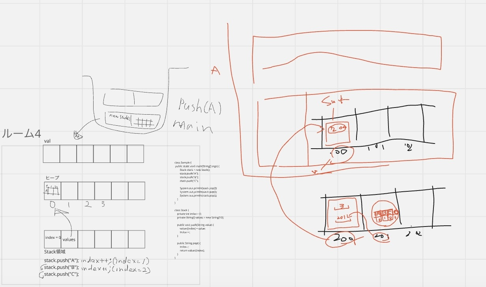

## コンストラクタ

バケツに上から入れるから、上から出ていく（先入後出し）

### それを実装しよう

indexとvalues
自分自身のvaluesのindex番目に配列が入っていく
0に入れたら1番目
1に入れたら2番目

スタックは最後のものから使われるので、index番目を戻すようにする

1つずつ、今一番簡単にできることからやる
配列に入っているコードから修正しよう

Stringのデータしか扱えない配列型の変数にA、B、Cと順番に入れた後にC、B、Aと出すためにどうしたら良いか？
何故nullが戻るのか？
->何も入っていない配列を参照しているから

'push'メソッドと'pop'メソッドを使って考えよう
Stackクラスのメモリの状態を絵で表そう
自分が戦える土俵で考える

ヒープクラス：Stackクラス
mainとStsck
'push'が呼ばれるとスタックが積まれる

スタックのフィールド2つをヒープのスタックに書く
**フィールド**は**ヒープ**に確保される
'new'されると新しくヒープにメモリが確保される

スタック宣言=メモリ確保
indexは0で初期化されて、配列のインスタンスを201に作る
201のリンクを200に入れる->リンクを辿れば201に行ける


200のstuckのインスタンスがある
mainメソッドの1行目をここまででやっている

```java
public class Sample {
    public static void main(String[] args) {

        Stack stack = new Stack();
        stack.push("A");
        stack.push("B");
        stack.push("C");

        System.out.println(stack.pop());
        System.out.println(stack.pop());
        System.out.println(stack.pop());
    }
}
```

右側がバケツに積まれる
上にpushメソッドが積まれる


```
しくみを考えること＝プログラミング
コードを書くことがプログラミングではない
```

Aの文字列はどこに持ってる？
->Aは履歴のように持ってて、メソッド領域（メタスペース）にある
スタック領域でもヒープ領域でもない
->一度使ったメソッドを貯めておくSrting Pool（使い回しのための場所）

**return**：スタックからスタックフレームを取り出しなさい、呼び出し元のメソッドに戻ってくださいという意味

**コンストラクタ**とは、インスタンスを初期化することが目的

コンパイルエラーになるから、インスタンス生成と同時にインスタンスが持たなければならないデータをリセットする必要がある

Orderにコンストラクタ

使う側と使われる側を考える必要がある
AをBに使う前にやっておかなければならないことを事前条件という

不変条件：お湯が97度以上＆水が入っている＆給湯可能な水が入っている
A->B：お湯ちょうだい
B->A：どうぞー

事前条件：呼び出し元の条件
普遍条件：呼び出し側の条件ん、メソッド実行中の条件（そもそもDBないじゃん）
事前条件：戻り値

最低でも3つの条件は満たさなきゃダメ

不燃条件を満たすためにコンストラクタ（newしたタイミング、事前に準備しておく）

コンストラクタはnewとセットじゃないと使えない
コンストラクタは戻り値型を使えない
コンストラクタは戻り値を記述することができない

戻り値：型は記述できない
コンストラクタ：インスタンスが作られたタイミング
