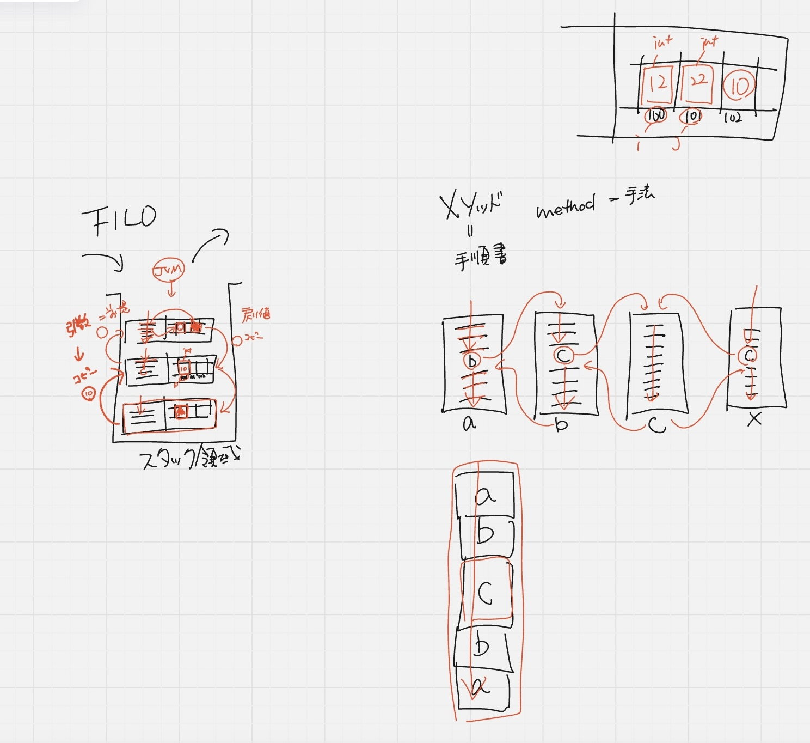

## メソッドとは

マニュアル、手順書

手順書から手順書を呼び出す

他のことをやりなさいと言われたら、他の手順書->残りをやる->戻るなど

1つの手順書でも上から下まで実施しないこともある

コピー：スタックフレーム（やるべきことの手順書のコピー）
ローカル変数（同じスタックフレーム内のみアクセスできる）
JVMはバケツの上からしか見てないので、一番上にあるものを実行する（終わったら取り外し）

ローカル変数は同じスタックフレーム内しかアクセスできないので、コピーして引数として渡し、コピーして戻り値として受け取る（アクセスできるなら渡す必要なし）

スタック領域＝メモリ
メモリには値のみで式は入らない
ローカル変数には式は入らないが、手順書には入る
クラスファイル（ディスク上＝冷蔵庫）->まな板（メモリ）に載せないと調理できない

クラスファイルからコピーされたのをスタックに持ってくる（スタックのコピー元はクラスファイル）
エントリーポイント（メインメソッド）からスタートする
mainは一番下
