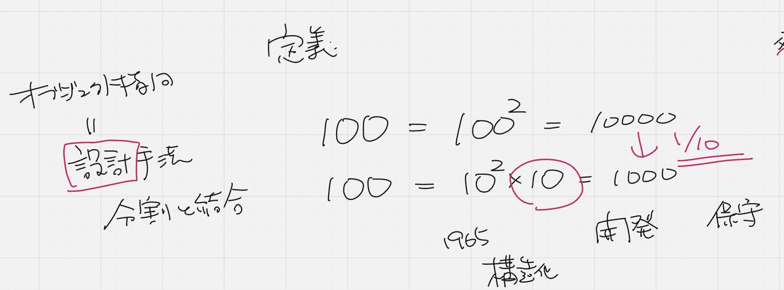

## 設計

設計とは：**分割**と**結合**を考えること
うまい繋ぎ方と下手な繋ぎ方がある
100という規模のソフトウェアがある
この作業工数が２乗ならという工数がかかる

10という規模を10個合わせる
10２乗×１０＝分けるとコストが下がる
コスト削減のためにどうしたらいいのかを考える

### コストの種類
- イニシャルコスト：開発時
- ランニングコスト：保守
保守 = アップデートのこと
使い続けるためには**運用**と**保守**が必要
どちらのコストを削減したいのかを考えなければならない
（イニシャルコストとランニングコストはシーソーゲーム）
どちらかが上がるとどちらかが下がるが、どっちも上がることもある
開発は外注するからイニシャルコストが上がる

開発＜保守 コスト関係
成長するソフトウェア
- 長く使い続けるソフトウェア
- 成長するソフトウェア

開発orイニシャルorランニング
どのコストに大きを置くのか？と考えなければならない

- 構造化設計（1965年）
- オブジェクト設計（1961年）
  
POA（処理中心）->DOA（データ中心）->OOA（オブジェクト）->SOA/BOA
ここでのAは全てアプローチ
オブジェクト指向で開発するとコード量が爆上がりする
->面倒臭いけど価値があるから使用される

何故POAからDOAになったか？
どんな処理、どんなデータを扱うかを考えなきゃならない
自動化するところとエンジニアが実行するところを考える

バッチ処理：ある一定の時間に自動的に起動し、AとBのデータを同じにする作業イニシャルorランニングどちらのコストを下げる？

前例がない新規開発の場合：構造化設計が良い（イニシャル設計が合ってる）
オブジェクト指向はランニングコストを下げるため＝リプレイス（長く使い続ける方が利益が大きい）
->古いシステムを置き換えるためにオブジェクト指向を使用した

### オブジェクト指向を活かせる設計をする必要がある

外部から刺激があれば、それに反応して動く
UIがどんな刺激を受けるか
Outside-In
外側＝UI
↓
裏側を作っていく
まず画面設計書を作る

Inside-outって何？
先に中の処理を考えるってどうするの？
中心になるのはビジネスロジック（ビジネスルール）
イベント処理とビジネスルールは全くの別物
データの扱い方のルール＝ビジネスルール
point仕様とルールは異なる概念である
仕様にはルールが盛り込まれている
