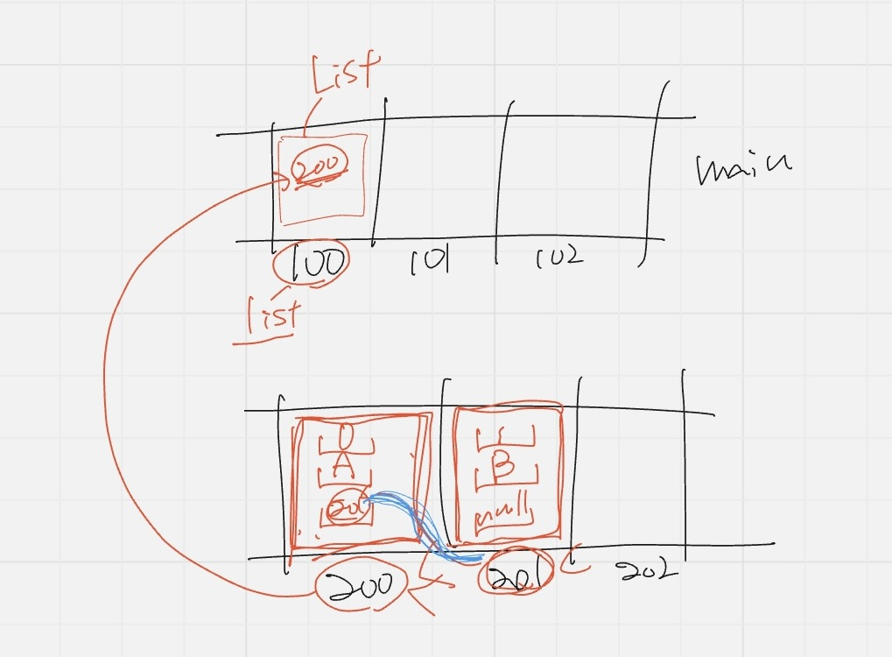

## オーバーロード（多重定義）

メソッドの名前：識別子

同じ名前のメソッドでも引数が異なれば、同じメソッドを複数定義できる

引数が異なるとは
- 引数の数
- 引数の順番
- 引数の型
⇧このセットのことを**シグニチャ**という

'return'はこれ以上進まない
だからスタックフレームから取り外してということ

目の前のコードが動いているわけではない
コピーが動いている！！

コピーを取りなさいというのは201
インスタンスとインスタンスが数珠繋ぎになっていることが理解できると良い
->絵で考えると裏側でJVMが何をやってるかが分かる

⭐️コンストラクタのルール
- **メソッド名**と**クラス名**は同じでなければならない

- Mutable: 可変オブジェクト
- Immutable: 不変オブジェクト

カプセル化: Cは3/5というデータを使って何かを戻す
不変条件が変わってしまうと、安心して使えない
CオブジェクトはMutableオブジェクトなので3/6になるかも

Aが3/6に変更するメソッドをCに対して送ると
Cは内部で変更せず、Dという3/6のデータを持つインスタンスを作成する

⇩DBに例える
Mutable＝何でもできる
Immutable：updateがない

設計する時にはMutableかImmutableにするかを考えなきゃならない